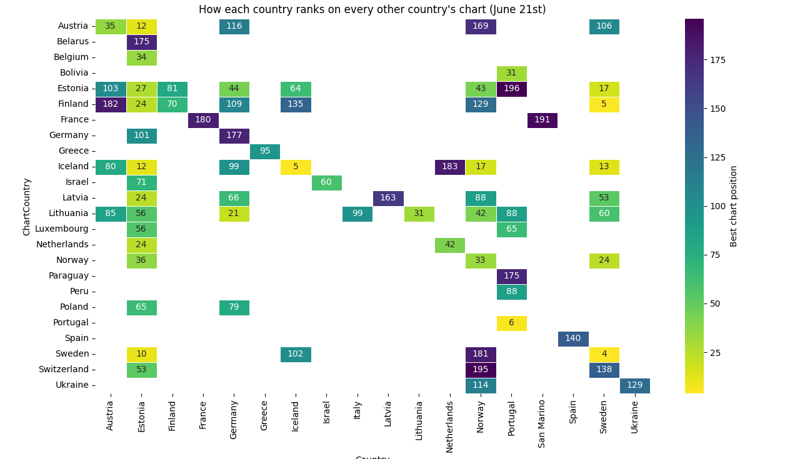
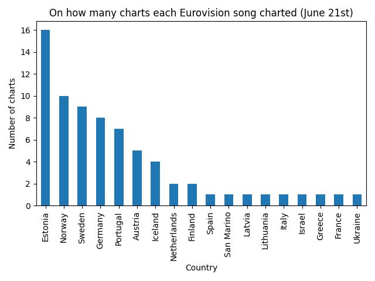

### From scoreboard to streaming: what Spotify data reveals about Eurovision 2025

When the glitter settled on Basel’s St. Jakobshalle, Austria’s operatic club anthem **“Wasted Love” by JJ** had lifted the crystal microphone with 436 points ([theguardian.com][1]). A few days later, on the first quiet Tuesday after the contest, I wondered how those songs were behaving in the real-world marketplace, more precisely, of Spotify plays. After taking a quick look at the Global Chart, I though that relying on the global chart alone is quite risky because a single stream from Berlin counts exactly the same as one from Reykjavík, even though Germany’s listener base is about 25 times larger.

So I pulled the daily top-200 chart **for every country that had a finalist** and for each, I looked for all the songs from the finals and which location on the chart they were. The result was a matrix: rows are the charting country, columns are the Eurovision songs (identified by the country they represented). Positions run from 1 to 200; blanks mean the track missed the top-200. I omitted column which were all blank.

## Week-one snapshot – hype everywhere

Two simple points raise from the above:
**1. Countries loved their own song**
Every finalist managed to crack its own domestic top-200. In fact, the median placing at home was an impressive number 3, with five delegations (Austria, Israel, Netherlands, Portugal and Sweden) debuting at number 1! Only Denmark and the United Kingdom saw their songs stall outside the top 50, maybe due to lower local enthusiasm or maybe just a stronger competition that week in the chart.

**2. Reach versus rank**
Counting how many national charts a track entered gives a people-powered view of popularity. The natural thing to do is to compare it to the competition result.

The scatter plot above compares that count with the Eurovision scoreboard. The line slopes down but not perfectly (correlation is about 0.61). It seems that the correlation is higher on the top entries which kinda makes sense. Either by people searchs focusing on them later to listen to the "winners", or vice versa as the more we go up the scoreboard the more the competition is really heated.

Some numbers:

- Austria – winner on stage and on Spotify, landing in 30 of 30 possible national charts.
- Estonia – the dark horse of this year. A bit silly and maybe offensive but really catchy song, not only got up to the third place but also almost tied with Austria for reach (29 charts).
- Germany – I didn't see this coming. Germany got only 15th on the scoreboard yet second–highest reach, appearing in 29 charts. Germany’s bilingual “Zeitgeist” turned out to a true hit.
- Portugal’s “Deslocado” finished 21st with 50 points, yet reached 16 national charts, tying France and outpacing higher-ranked Malta and Norway. I admit that I really liked this little song so this discovery made me smile.

### Side note – the **Eurovibe level**

After looking at the heatmap above, I wondered: Spotify’s country charts let us approximate how much domestic listeners embrace the contest as a whole, not just their own entry. I counted, for every market, how many of the 26 finalist songs entered the local top-200 in the first post-Eurovision snapshot and then grouped countries into four intuitive bands.
I'm curious to see if this is consistant through the years.
By the way, I'm open to better naming for this made up metric.

| Eurovibe level | Definition                     | Markets that qualify                                                                                                         | Quick read                                                                                                                                                                                                                                      |
| -------------- | ------------------------------ | ---------------------------------------------------------------------------------------------------------------------------- | ----------------------------------------------------------------------------------------------------------------------------------------------------------------------------------------------------------------------------------------------- |
| **Heatwave**   | 20 – 26 finalist songs charted | Austria, Estonia, Finland, Iceland, Latvia, Lithuania, Sweden, Switzerland, Germany, Netherlands, Norway, Poland, Luxembourg | These places, at least for this week, seems to breathe Eurovision. The Nordics and Baltics sit here every year, but notice **Germany** and **Netherlands**: big populations where the contest clearly broke through the mainstream algorithms.  |
| **Warm**       | 10 – 19 songs                  | Belgium, Denmark, Greece, Israel, Ukraine                                                                                    | Solid interest: plenty of cross-border listening yet not quite full-playlist devotion.                                                                                                                                                          |
| **Mild**       | 4 – 9 songs                    | Spain, United Kingdom, Italy, Portugal, Czech Republic, Belarus, Hungary, Ireland, Slovakia                                  | These audiences mostly stream their own act plus a handful of viral standouts (often the winner and one or two uptempo bops).                                                                                                                   |
| **Frosty**     | 0 – 3 songs                    | France, Bulgaria, Romania                                                                                                    | Either local catalogue and global hits dominate the charts, or Eurovision simply isn’t driving streaming behaviour here. France’s low score echoes past editions: strong TV ratings, but listeners head back to the day to day sounds promptly. |

For those who prefer, here is the score as a bar chart:

---

## One month later – which songs stuck?

I repeated the scrape four weeks later. Most tracks had slipped away, but some endured. The graphic below shows the share of original chart appearances each song retained. A value of 0.55 means the track still appears in 55 percent of the countries where it charted during week one.

Three observations emerge:

1. **Estonia holds the crown for staying power.** “Espresso Macchiato” stayed on most charts, by keeping 16 of its initial 29 placements, a retention rate of 55%. That might suggests organic replay rather than just a momentary meme. If you want, Tommy Cash is the true winner of this year, or at least the true hit maker.
2. **Slow-burners rise:** Portugal’s intimate ballad “Mar Anil” placed only 12th on the Eurovision scoreboard, yet it preserved nearly 44 percent of its early traction, edging Norway’s fan-favorite “Northern Lights”. I got to be honest, Norway's entry was, in my personal taste, quite generic so I'm a bit surprised
3. **Winners fade faster than you think.** JJ’s victorious “Wasted Love” slipped to a 17 percent survival rate. I wonder if this strengthen the case of those criticizing the scoring system, or maybe it is just a common phenomenon.

---

## Where Eurovision fever lingers

Looking at the charts rather than the songs, eight territories still hosted at least seven Eurovision tracks a month on. Lithuania and Estonia lead with eight apiece, followed by Finland and Iceland on seven. The Baltic-Nordic axis clearly keeps the contest in heavy rotation well into June.

---

## Takeaways?

Not much, just that, maybe, a high final rank guarantees initial curiosity, not durability.Oh, and that some countries are really into Eurovision songs while some are not.

In the end, all these numbers were collected out of pure curiosity and for the fun of comparing Eurovision hype with real-world listening. They rely on two isolated Spotify snapshots and ignore dozens of other platforms, cultural quirks and release-week coincidences. Treat the Eurovibe tiers and survival ratios as conversation starters, not precision metrics, and assume we are certainly missing plenty of factors that shape each country’s musical landscape.

_ Code aveliable [here](https://github.com/menisadi/eurovision2025) _
