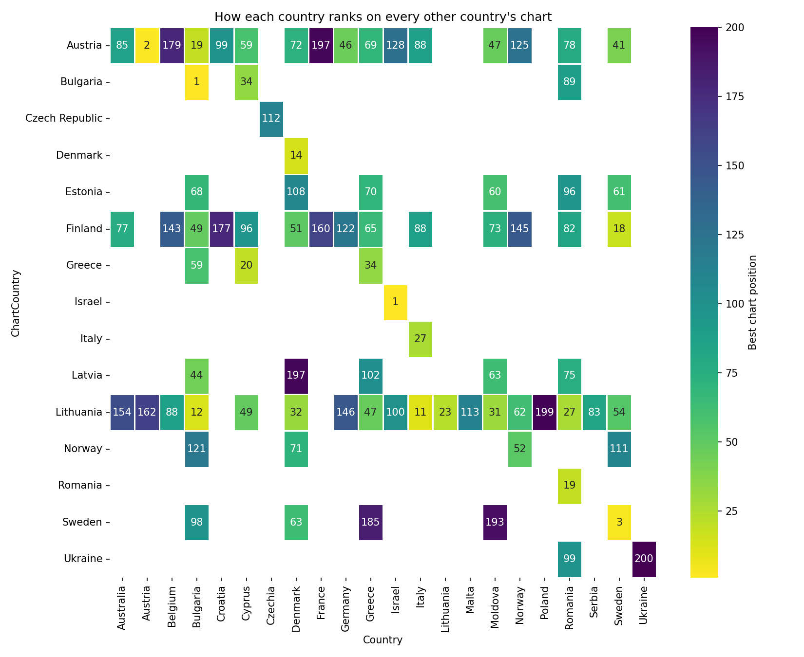
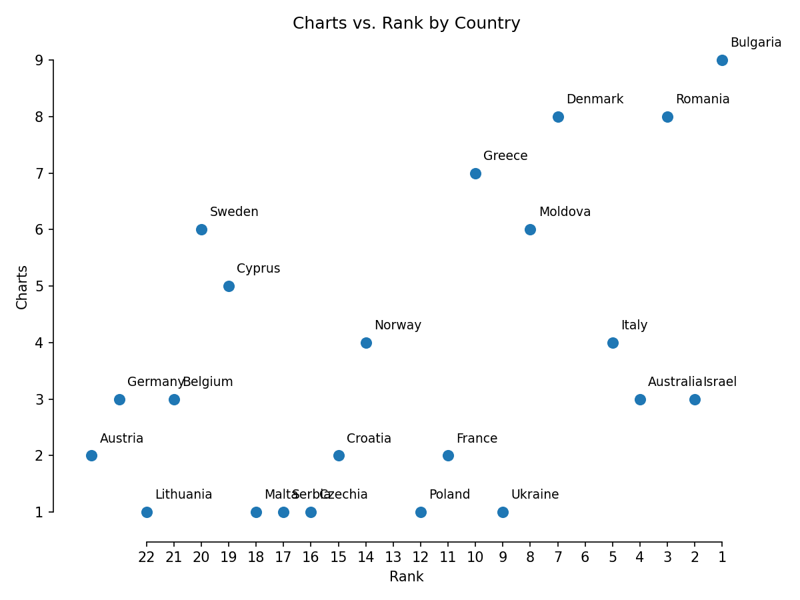
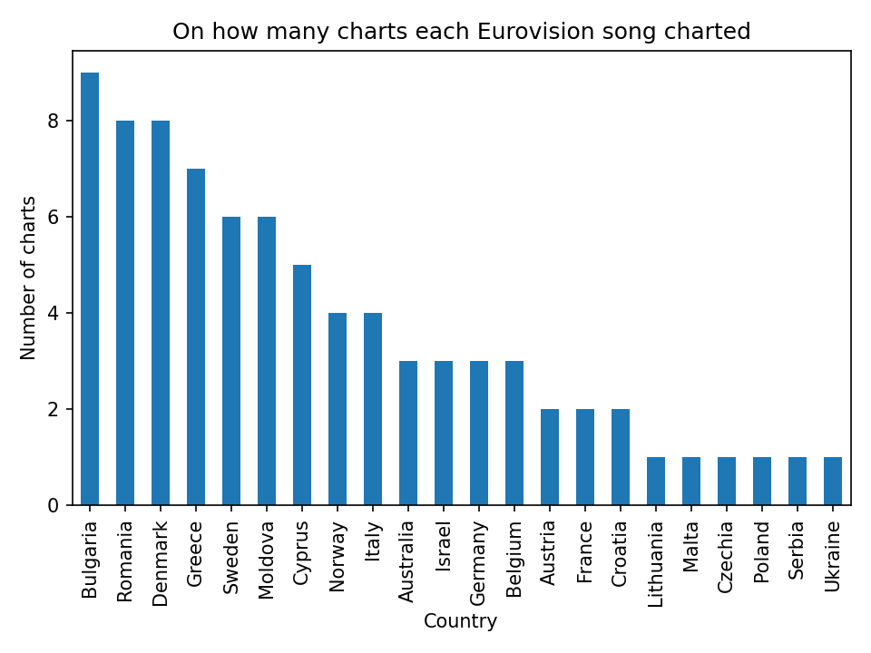
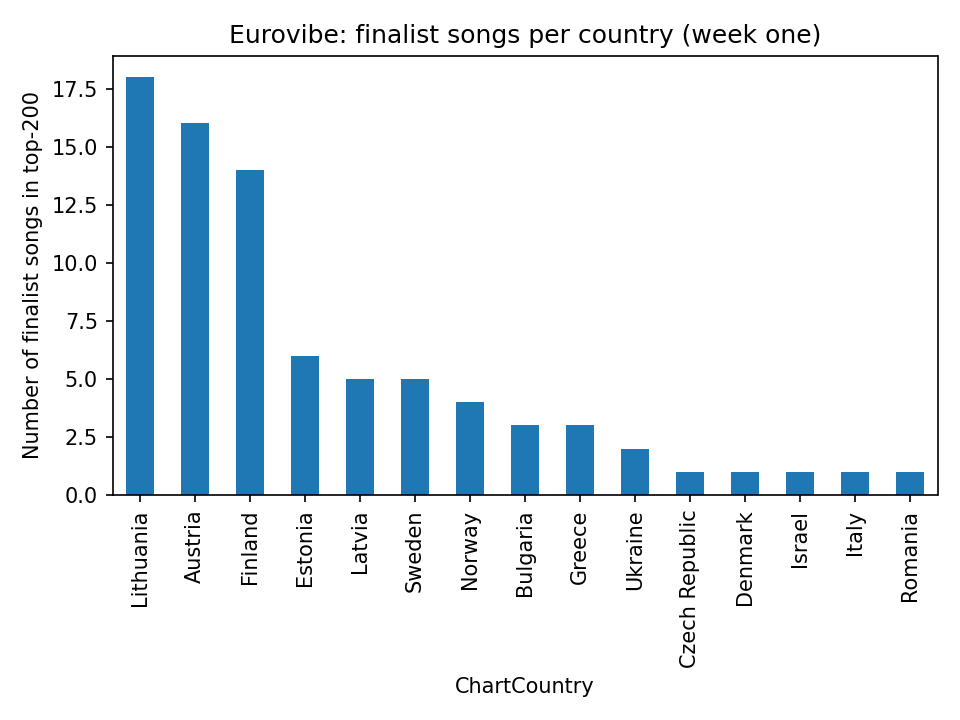

[INTRO — personal note about this year's contest, winner, Vienna, etc.]

This year, when the glitter settled on Vienna's [VENUE], Bulgaria's [DESCRIBE SONG] [**"Bangaranga" by Dara**](YOUTUBE_LINK) had lifted the crystal microphone with 516 points. [PERSONAL REACTION / HOOK FOR THE ANALYSIS]

So I pulled the daily top-200 chart **for every country I could find a Spotify chart** and looked for all the songs from the final, recording their position. The result is a matrix: rows are the charting country, columns are the Eurovision songs (identified by the country they represented). Positions run from 1 to 200; blanks mean the track missed the top-200.

Note: this snapshot was taken on the day of the contest itself — earlier than last year's first snapshot, so overall chart penetration is lower than we'd expect a few days later.

## Day-one snapshot

**1. Countries loved their own song**
[OBSERVATIONS about home-country charting — who debuted at #1, who stalled]

**2. Reach versus rank**
Counting how many national charts a track entered gives a people-powered view of popularity.

[OBSERVATIONS about the scatter — correlation, outliers]

If we focus just on the chart count:

Some numbers:

- **Bulgaria** – "Bangaranga" by Dara led with 9 chart appearances across the 76 markets tracked — the most of any entry on day one.
- **Romania** and **Denmark** – tied in second place with 8 charts each. [PERSONAL TAKE]
- **Finland** and **Albania** – [OBSERVATION — note they didn't appear, interesting given Finland usually scores high Eurovibe]

[OTHER OUTLIERS / NOTABLE OBSERVATIONS]

### Side note — the **Eurovibe level**

How many of the 25 finalist songs charted in each country's domestic top-200 on day one?

| Eurovibe level | Definition | Markets that qualify | Quick read |
| --- | --- | --- | --- |
| **Heatwave** | 15–25 finalist songs charted | Lithuania (18), Austria (16), Finland (14) | [OBSERVATION] |
| **Warm** | 5–14 songs | Estonia (6), Latvia (5), Sweden (5), Norway (4) | [OBSERVATION] |
| **Mild** | 2–4 songs | Bulgaria (3), Greece (3), Ukraine (2) | [OBSERVATION] |
| **Frosty** | 0–1 songs | Czech Republic, Denmark, Israel, Italy, Romania, and most of the world | [OBSERVATION — note this may change as charts update in the coming days] |

---

## One month later — who stuck around?

_[TO BE ADDED after a second chart snapshot in ~4 weeks]_

---

## Takeaways?

[PERSONAL TAKEAWAY]

_[Code available [here](https://github.com/menisadi/eurovision2025)]_
